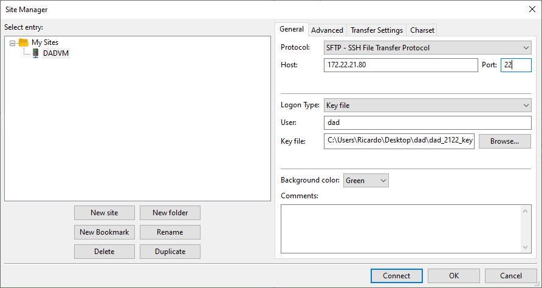
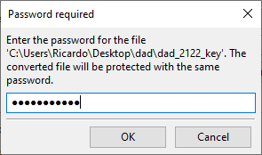
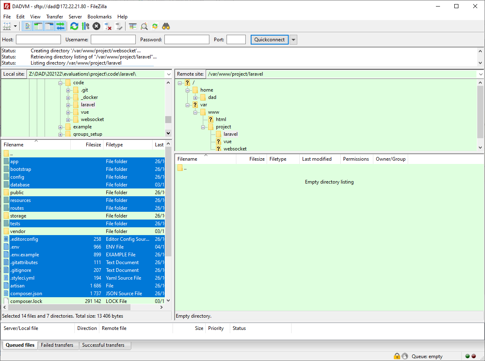

# Deploy Code

In this Tutorial we'll look at how to deploy ouer code initial and in subsequent changes.

::: danger NOTICE
Most of the commands in this Tutorial are to run on the Virtual Machine in an SSH Session ([read Connecting Tutorial](./connect.md)), the commands that need to run on our **local machines** are properly stated.
:::

## Setup Project and NGINX

This tutorial assumes that we are using the following folder structure. If you want to change that structure please change de commands accordingly:

```txt
/
|___var
|   |___www
|   |   |___project
|   |   |   |___laravel         # laravel api code
|   |   |   |___vue             # vue built code
|   |   |   |___websocket       # node websocket server code
```

The `/var/www`folder already exists so lets create ours:

```bash
sudo mkdir -p /var/www/project/{laravel,vue,websocket}
```

We need to give access to these folders to NGINX, and by default it uses the `www-data` user and group. The following commands are to add that group to our user and to change the permitions of the folders we just created:

```bash
sudo usermod -a -G www-data dad
sudo chown -R www-data:www-data /var/www/project
sudo chmod -R g+rw /var/www/project
```

::: warning usermod
The usermod command will only take effect on our next login, or if we want to keep the current connection we can run the command `su dad` to create a new session.
:::

## Deploy Code

The next step is to get our code into the machine. There are several ways to do this. We'll look at two options. The first using `rsync` only woks on Linux, MacOS or Windows in WSL, this option is the less human error prone, but for Windows users we need to setup WSL (see the [Windows WSL Tutorial](./wsl.md)). The second option is mostly for Windows users, but can be used in the other OSs, and it uses a GUI software called Filezilla.

### VueJS Build

The VueJS component is going to be handled differently from the rest because we are going to build the static assets, and those are going to the only assest for the deployment.

Before build we need to make sure we have the proper environment variables. create two files, named `.env.development` and `.env.production` on the root of the VueJs Project with the following contents (this code is available in file form in the snippets folder of the [Tutorial Github Repository](https://github.com/ricardogomes/DAD-2023-24-Project-Tutorials))

<Badge type="danger" text="Local files" />
<<< ../snippets/env.development_snippet
<<< ../snippets/env.production_snippet

Now on our `main.js` file we can use those environment variables:

```js
//...
const apiDomain = import.meta.env.VITE_API_DOMAIN
const wsConnection = import.meta.env.VITE_WS_CONNECTION
//...

//...
app.provide('serverUrl',`${apiDomain}/api`)
app.provide('socket',io(wsConnection)
//...
```

Finally run the following command, locally, on the root of the VueJS project:

<Badge type="danger" text="Local Command" />
::: code-group
```bash [NPM]
npm run build
```
```bash [Bun]
bun run build
```
```bash [YARN]
yarn run build
```
```bash [PNPM]
pnpm run build
```
:::

This will create a local folder named dist that we'll use on later steps.

### Using rsync

Let's look at each of our architectural components one at a time.

#### Laravel

To deploy our Laravel code we need to run the following command in the folder one level up from the laravel folder, and we assume that the Laravel project is in a folder called `laravel`:

<Badge type="danger" text="Local Command" />
```bash
rsync -avz -e "ssh -i <path_to_your_ssh_key>" --exclude '.env' --exclude 'node_modules/' --exclude "vendor" \
--exclude "public/storage" --exclude "storage/app" --exclude "composer.lock" \
laravel dad@<vm_ip_address>:/var/www/project/
```

#### VueJS

To deploy our Laravel code we need to run the following command in the folder of our local VueJS project:

<Badge type="danger" text="Local Command" />
```bash
rsync -av -e "ssh -i <path_to_your_ssh_key>" dist/ dad@<vm_ip_address>:/var/www/project/vue/
```

#### Web Sockets

To deploy our Web Sockets code we need to run the following command in the folder one level up from the Web Sockets project folder, and we assume that the project is in a folder called `websocket`:

<Badge type="danger" text="Local Command" />
```bash
rsync -av -e "ssh -i <path_to_your_ssh_key>" websocket dad@<vm_ip_address>:/var/www/project/
```

### Using Filezilla

Start by installing [FileZilla - The free FTP solution](https://filezilla-project.org/) from the project website, or if we use Chocolatey with the following command (in an administrator PowerShell):

```powershell
choco install filezilla
```

With Filezilla opened select File->Site Manager and create a new connection. Fill you VM data, including the ssh key (private), as seen in the following capture:



Filezilla uses a different SSH key format but it will convert it for us:



Now let's look at each of our architectural components one at a time.

#### Laravel

Sending files to the server is fairly intuitive in Filezilla, but for ease of later configurations its best if we limite the files send to the only ones required. To that effect we will not copy the following files / folders:

- vendor: because it has the dependencies for our local dev environment
- public: mostly because of the storage symlink
- storage: because of the files generated by the seeder
- .env: because it has our configurations



After this step you need to create the public folder on the VM and copy everything except the storage symlink.

Do the same for the storage folder but this time copy everything except the contents of the app folder.

#### VueJS

Using the same process as for the Laravel project, copy the **contents** of the local build folder inside of the VueJS project to the `/var/www/project/vue/` folder on the VM.

#### Web Sockets

Using the same process as for the Laravel project, copy the local folder of the Web Sockets project to the `/var/www/project/websockets/` folder on the VM.

## Setting Up the Projects

Now that we have the code on the server we need to install the dependencies and setup some configurations.

### Laravel

On the server in the root of the `laravel` folder run the command:

```bash
composer install
```

After edit (or create) the `.env` file and setup the needed configurations, namely the database section. For the server the `DB_HOST`should be `localhost`, the `DB_USERNAME` root and the `DB_PASSWORD` the one defined in the [Install Components Tutorial](./install.md), the `DB_DATABASE` will be `project` (feel free to change).

The next step is to create the database, run the first command to access the MySQL shell them run the second:

```bash
mysql -u root -p #supply password when request
```

```sql
CREATE DATABASE project
```

Having those configurations run the following commands:

```bash
php artisan key:generate        # Generates a new random key for Laravel
php artisan migrate             # Creates the database tables
php artisan db:seed             # Seeds the database
php artisan storate:link        # Creates Smylink
```

If using Laravels' Passport component, run the following command and update the `.env` file accordingly.

```bash
php artisan passport:install
```

### Web Sockets

On the root folder of the Web Sockets project (`/var/www/project/websockets`) run the following commands:

::: code-group

```bash [NPM]
npm install
```

```bash [Bun]
bun install
```

```bash [YARN]
yarn install
```

```bash [PNPM]
pnpm install
```

:::

Now we'll use PM2 to start the project.

```bash
pm2 start index.js #change the file to the project entry point if necessary
```

### NGINX and VueJS

Since the VueJS on the server is composed of only static files we don't need to configure anything.

All thats left is to configure NGINX to support these components. We will be using the reverse proxy feature to configure NGINX to handle these paths on our application:

```txt
/           ->  Vue App
/api        ->  Laravel App
/storage    ->  Laravel App
/oauth      ->  Laravel App
/socket.io  ->  WebSocket Server
```

Assuming the PHP-FPM component runs as Unix Socket, and that we setup the Web Sockets Server to listen on port `8080`, this sould be the code we need (this code is available in file form in the snippets folder of the [Tutorial Github Repository](https://github.com/ricardogomes/DAD-2023-24-Project-Tutorials)):

<<< ../snippets/nginx_site_config

We can delete the default file and create a new one with the above content:

```bash
sudo rm /etc/nginx/sites-enabled/default
```

::: code-group

```bash [nano]
sudo nano /etc/nginx/sites-availabel/dad
```

```bash [vim]
sudo vim /etc/nginx/sites-available/dad
```

:::

Finally we create a symlink to enable the configuration, run `nginx -t` to make sure everything is correct and restart the NGINX service.

```bash
sudo ln -s /etc/nginx/sites-available/dad /etc/nginx/sites-enabled/dad
sudo nginx -t
sudo systemctl restart nginx
```

Make sure to reset the permissions on the server files for NGINX:

```bash
sudo chown -R www-data:www-data /var/www/project
sudo chmod -R g+rw /var/www/project
```

After that if we navigate to the server IP address on a browser we should see the project running.

::: tip Adicional Resources

- [Navigating Files and Directories – Intro to Bash Shell](https://ucsbcarpentry.github.io/2021-01-21-SWC-Bash-online/02-filedir/)
- [Production Deployment | Vue.js](https://vuejs.org/guide/best-practices/production-deployment.html#without-build-tools)
- [Deploying a Static Site | Vite](https://vitejs.dev/guide/static-deploy.html)
- [Env Variables and Modes | Vite](https://vitejs.dev/guide/env-and-mode.html)
- [How To Use Rsync to Sync Local and Remote Directories | DigitalOcean](https://www.digitalocean.com/community/tutorials/how-to-use-rsync-to-sync-local-and-remote-directories)
- [Documentation - FileZilla Wiki](https://wiki.filezilla-project.org/Documentation)
- [NGINX Reverse Proxy | NGINX Documentation](https://docs.nginx.com/nginx/admin-guide/web-server/reverse-proxy/)

  :::
