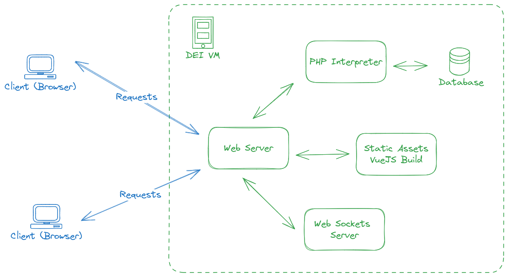

---
# https://vitepress.dev/reference/default-theme-home-page
layout: home

hero:
  name: "Project Tutorials"
  text: "Tutorials related to the DAD 2023/24 course project"
  actions:
    - theme: brand
      text: Connect to VM
      link: /connect
    - theme: alt
      text: Install Components
      link: /install
    - theme: alt
      text: Deploy Code
      link: /deploy
# features:
#   - title: Feature A
#     details: Lorem ipsum dolor sit amet, consectetur adipiscing elit
#   - title: Feature B
#     details: Lorem ipsum dolor sit amet, consectetur adipiscing elit
#   - title: Feature C
#     details: Lorem ipsum dolor sit amet, consectetur adipiscing elit
---

In this documentation we have a set of tutorials to help us implement the 2023/24 Project.

<h2 style="font-size:1.8em; font-weight:bold; margin: 30px 0; clear:both;"> Infrastructure </h2>

The major concern is the creation of the infrastructure that will support our Project. This is the architectural overview:

We suggest specific technological components, but you are free to try other approaches, so long as the Project Mandatory Constraints are fulfilled.

These are the suggested components:

Follow the the tutorials to connect to the provided VM and set up the Ptoject. Happy Coding.

