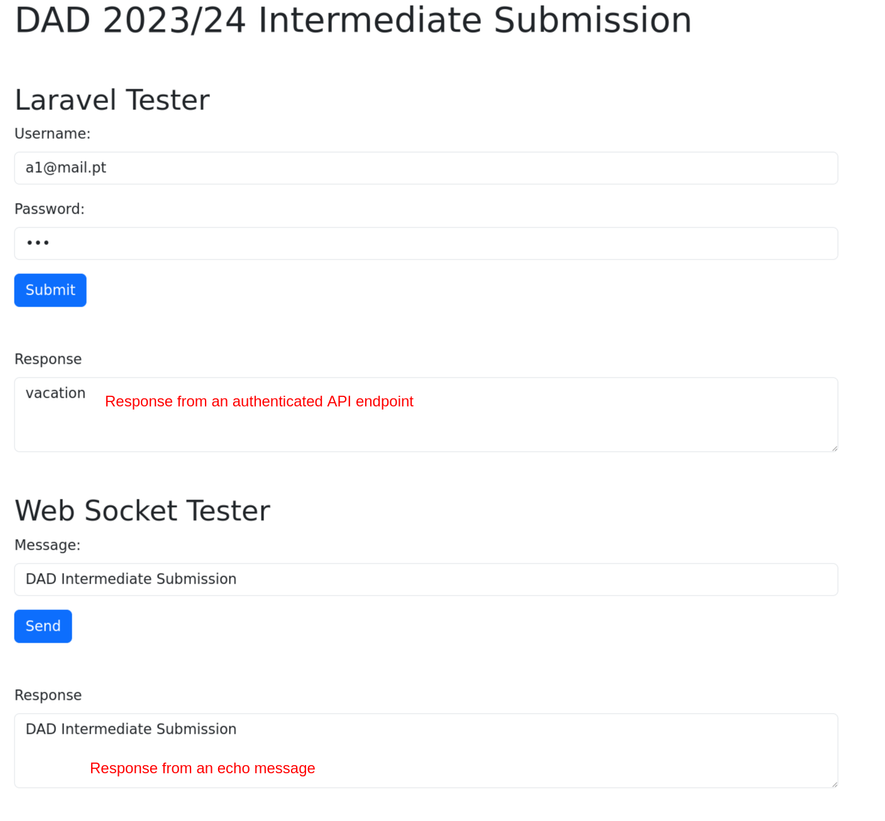

# DAD 2023/24 Intermediate Submission

This tutorial shows us how to implement the necessary features for the Intermediate Submission.

We can deploy the code we already have for the project, these options are only for the case were we don't have one, or more, of the requirements:

- Autheticated API endpoint
- Echo message Web Socket
- VueJS UI triggers

The [repository](https://github.com/ricardogomes/DAD-2023-24-Project-Tutorials) of this Tutorial, on the `code` folder has all the code needed for these features, and the following image shows the implemented funcionality:

## Components

The purpose of this submission is to make sure we can properly deploys all technological components (see the other Tutorials on this site) to our Virtual Machine.

The code should be mostly straight forward but here are the most relevant components.

### Laravel

For Laravel we implemented Passport for authentication (see the [tutorial](./passport.md)), and the controller for Categories for the simple, paginated GET.

Contents `/app/Http/Controllers/auth/AuthController.php`;

<<< ../code/laravel/app/Http/Controllers/auth/AuthController.php

Contents `/app/Http/Controllers/CategoryController.php`;

<<< ../code/laravel/app/Http/Controllers/CategoryController.php

Contents `/routes/api.php`;

<<< ../code/laravel/routes/api.php

### Web Sockets

For the Web Socket Server, use're using SocketIO (see the [SocketIO tutorial](./socketio.md)) to implement a simple echo message, in which the server simply replies to the socket with the same message that it received.

Contents `/index.js`;

<<< ../code/websockets/index.js

### VueJS

For VueJS we implemented the necessary elements on the `main.js` file and two components, one to test the Laravel endpoints and another for the Web Sockets:

Contents `/src/main.js`;

<<< ../code/vue/src/main.js

Contents `/src/components/LaravelTester.vue`;

<<< ../code/vue/src/components/LaravelTester.vue

Contents `/src/components/WebSocketTester.vue`;

<<< ../code/vue/src/components/WebSocketTester.vue
