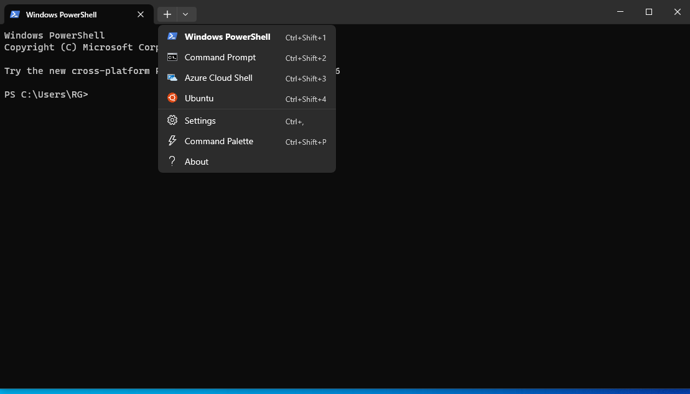
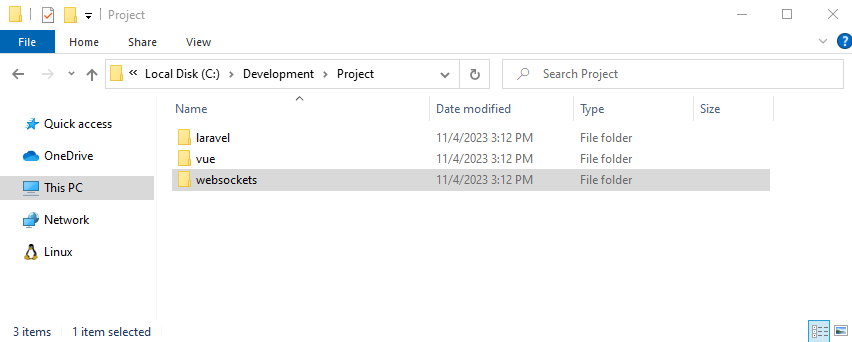
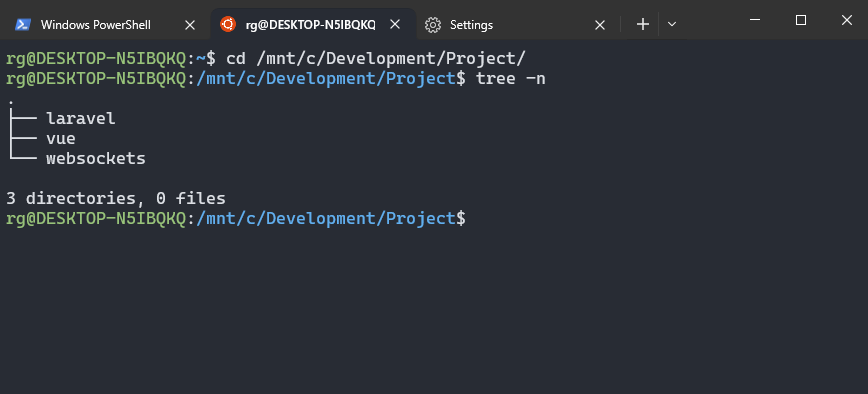

# Windows Subsystem for Linux

Windows Subsystem for Linux (WSL) is a way to run a Linux distribution on a Windows machine without the need for a full VM.

For our project WSL is not a requirement, still for some use cases it could prove usefull.

## Install WSL

To install WSL run the following command on a administrator PowerShell:

```powershell
wsl --install
```

After this step we need to **reboot** our machine and install a Linux distribution.

## Install Ubuntu

Run the following command to install Ubuntu, again from a administrator PowerShell:

```powershell
wsl --install -d Ubuntu
```

During this step we'll be asked to setup a username and password, and after that we have access to a full Linux distribution.

## Using WSL

One usefull tool to use for WSL is the Terminal application (installable from the Windows Store).



On the dropdown option of the Terminal app we can choose Ubuntu to access a bash shell for our distribution.

If we want we can use Docker inside WSL to fully develop our project, but that requires a few more steps and its outside the scope of this tutorial.

For now we only want to access our Windows DAD project and be able to run commands like the `rsync` command.

Inside our Ubuntu shell we can access our full disks by going to `/mnt/<disk>`. Let's assume we have our Project inside the Development folder on our C: disk.



We can see our code on the Ubuntu shell like this:



Most of the commands on the other tutorials require SSH access to our VM. The simplest way to accomplish this is to copy the SSH keys to the Linux home directory. Navigate on Windows `File Explorer to Linux -> home -> <Your User>` and create a folder called `.ssh` (mind the .), copy your SSH key to this directory and rename it to `id_rsa` (and the accompaning `id_rsa.pub`). Finally on the Ubuntu shell run the following command:

```bash
sudo chmod 600 ~/.ssh/id_rsa*
```

The `rsync` and other similar commands on the other tutorials should now run on this shell.

:::tip Adicional Info

- [Install WSL | Microsoft Learn](https://learn.microsoft.com/en-us/windows/wsl/install)
- [Get started using VS Code with WSL | Microsoft Learn](https://learn.microsoft.com/en-us/windows/wsl/tutorials/wsl-vscode)
- [Working across file systems | Microsoft Learn](https://learn.microsoft.com/en-us/windows/wsl/filesystems)
  :::
